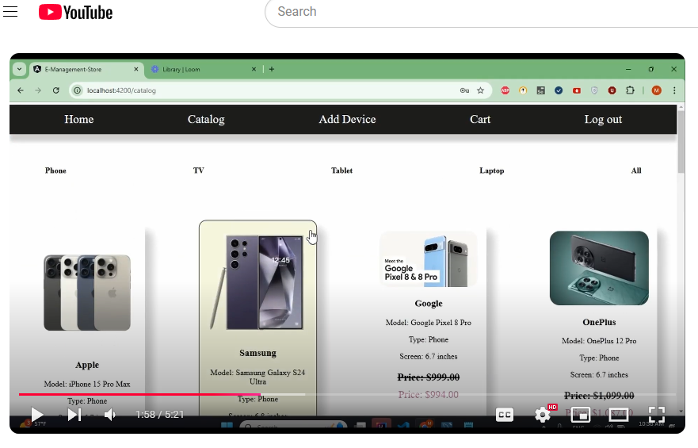

# Full-Stack Store Management Application

**Author**: Mahdi

## Overview
Welcome to my full-stack application! This project is designed to provide a secure, user-friendly experience for managing a store catalog, allowing users to register, sign in, and interact with various products. The web app is also fully mobile responsive, ensuring a seamless and optimized experience across all devices, from desktops to tablets and mobile phones

### Important Note
**Please note:** You will need to first register and then log in to access the application.

Since this application is hosted on a free Render instance, it may take approximately **1 minute for the server to process registration requests**. Free Render instances go into a "sleep" mode after periods of inactivity, which can delay initial responses by up to **50 seconds or more**.

---

Thank you for your patience as the server initializes!

## Key Components

- **Catalog**: The catalog is one of the main components of this application. Here, users can view different types of devices, such as:
  - Phones
  - Tablets
  - TVs
  - Laptops

  Users have the following options for managing devices:
  - **Add** new devices to the catalog.
  - **Update** details of existing devices.
  - **Remove** devices from the catalog as needed.

 ## Youtube Video
 

## Technology Stack

### Front-End
- **Framework**: Angular (version 16) with TypeScript.
- **IDE**: Visual Studio Code.

### Back-End
- **Framework**: Spring Boot (version 3.3.5) with Java (version 23).
- **Database**: MySQL.
- **Build Tool**: Maven.
- **IDE**: IntelliJ IDEA.

### Additional Tools
- **API Testing**: Postman for testing API endpoints.

## Features

- **Secure Login**: Users must log in before accessing the catalog. The login form includes validation on both email and password fields to ensure required information is provided. The login button remains disabled if either field is left empty.
  
- **Device Management**: The catalog allows users to:
  - **View** available devices in the store.
  - **Add** devices to the catalog.
  - **Update** device details.
  - **Remove** devices from the catalog.

This project was generated with [Angular CLI](https://github.com/angular/angular-cli) version 16.2.16.

## Development server

Run `ng serve` for a dev server. Navigate to `http://localhost:4200/`. The application will automatically reload if you change any of the source files.

## Code scaffolding

Run `ng generate component component-name` to generate a new component. You can also use `ng generate directive|pipe|service|class|guard|interface|enum|module`.

## Build

Run `ng build` to build the project. The build artifacts will be stored in the `dist/` directory.

## Running unit tests

Run `ng test` to execute the unit tests via [Karma](https://karma-runner.github.io).

## Running end-to-end tests

Run `ng e2e` to execute the end-to-end tests via a platform of your choice. To use this command, you need to first add a package that implements end-to-end testing capabilities.

## Further help

To get more help on the Angular CLI use `ng help` or go check out the [Angular CLI Overview and Command Reference](https://angular.io/cli) page.
